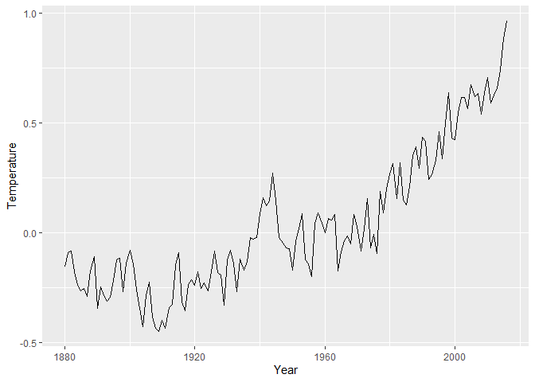

HW1
================
Ossian Hättestrand
2021-11-02

## Past experiences

I have used R, Rstudio and Rmarkdown in several courses over the past
year. But my knowledge does not surpass the bare minimum that is needed
for writing simple statistical rapports. I used Git and Github in one
course last semester, but then again, no extensive knowledge. I have not
used ggplot2 or dplyr before this course.

## Data display

To illustrate some data i goggled “Global temperature time dataset” and
downloaded a nice zip file from
“<https://datahub.io/core/global-temp#data-cli>” with 2 different
datasets in csv form, one with annual tracking of the temperature and
one with monthly. Since i am intrested in the temperature changes over
long spans of time, i chose the file with annual tracking and copied it
to my HW1 folder and read it into R with the code below.

``` r
mydata <- read.csv("annual_csv.csv")
```

Here we have a graph (made with ggplot2) of the data.
<!-- -->

``` r
sessionInfo()
```

    ## R version 4.1.1 (2021-08-10)
    ## Platform: x86_64-w64-mingw32/x64 (64-bit)
    ## Running under: Windows 10 x64 (build 19043)
    ## 
    ## Matrix products: default
    ## 
    ## locale:
    ## [1] LC_COLLATE=Swedish_Sweden.1252  LC_CTYPE=Swedish_Sweden.1252   
    ## [3] LC_MONETARY=Swedish_Sweden.1252 LC_NUMERIC=C                   
    ## [5] LC_TIME=Swedish_Sweden.1252    
    ## 
    ## attached base packages:
    ## [1] stats     graphics  grDevices utils     datasets  methods   base     
    ## 
    ## other attached packages:
    ## [1] forcats_0.5.1   stringr_1.4.0   purrr_0.3.4     readr_2.0.2    
    ## [5] tidyr_1.1.4     tibble_3.1.5    tidyverse_1.3.1 dplyr_1.0.7    
    ## [9] ggplot2_3.3.5  
    ## 
    ## loaded via a namespace (and not attached):
    ##  [1] tidyselect_1.1.1 xfun_0.27        haven_2.4.3      colorspace_2.0-2
    ##  [5] vctrs_0.3.8      generics_0.1.1   htmltools_0.5.2  yaml_2.2.1      
    ##  [9] utf8_1.2.2       rlang_0.4.12     pillar_1.6.4     glue_1.4.2      
    ## [13] withr_2.4.2      DBI_1.1.1        dbplyr_2.1.1     modelr_0.1.8    
    ## [17] readxl_1.3.1     lifecycle_1.0.1  munsell_0.5.0    gtable_0.3.0    
    ## [21] cellranger_1.1.0 rvest_1.0.2      evaluate_0.14    labeling_0.4.2  
    ## [25] knitr_1.36       tzdb_0.2.0       fastmap_1.1.0    fansi_0.5.0     
    ## [29] highr_0.9        broom_0.7.10     Rcpp_1.0.7       scales_1.1.1    
    ## [33] backports_1.3.0  jsonlite_1.7.2   farver_2.1.0     fs_1.5.0        
    ## [37] hms_1.1.1        digest_0.6.28    stringi_1.7.5    grid_4.1.1      
    ## [41] cli_3.1.0        tools_4.1.1      magrittr_2.0.1   crayon_1.4.2    
    ## [45] pkgconfig_2.0.3  ellipsis_0.3.2   xml2_1.3.2       reprex_2.0.1    
    ## [49] lubridate_1.8.0  rstudioapi_0.13  assertthat_0.2.1 rmarkdown_2.11  
    ## [53] httr_1.4.2       R6_2.5.1         compiler_4.1.1
